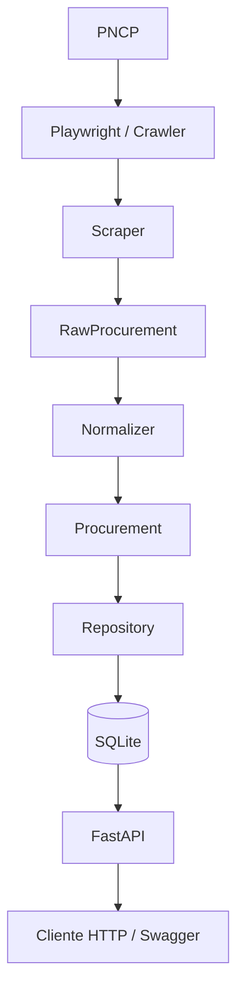

# PNCP Coletor de Contratações Públicas

Projeto feito por: João Pedro Gurgel Tomaz Farias Fernandes

Aplicação para coleta, normalização, persistência e consulta de contratações públicas disponíveis no **Portal Nacional de Contratações Públicas (PNCP)**.

O projeto foi desenvolvido como uma solução de coleta de dados web com foco em:

- paginação;
- normalização dos dados;
- deduplicação e idempotência;
- tratamento de falhas;
- controle de requisições;
- persistência em SQLite;
- disponibilização dos dados por API HTTP;
- testes automatizados;
- execução local ou via Docker.

---

## Fonte dos dados

A fonte utilizada é o catálogo público de **Editais e Avisos de Contratações** do PNCP:

```text
https://pncp.gov.br/app/editais
```

O catálogo é uma aplicação renderizada por JavaScript. Durante a etapa de exploração foi verificado que o HTML inicial obtido por uma requisição HTTP convencional não contém os registros necessários para a coleta.

Por esse motivo, a solução utiliza **Playwright com Chromium**, permitindo aguardar a renderização do catálogo e acessar os registros apresentados na interface pública.

A seleção da fonte e os experimentos realizados durante essa etapa estão documentados em:

```text
docs/decisions/001-source-selection.md
```

Também foram mantidos alguns experimentos em `spikes/pncp/` para registrar decisões tomadas durante o desenvolvimento.

---

## Arquitetura

A aplicação foi dividida em componentes com responsabilidades específicas.



O fluxo principal é:

1. O crawler percorre as páginas do catálogo utilizando Playwright.
2. O scraper interpreta o texto renderizado de cada contratação.
3. Os dados extraídos são representados inicialmente como `RawProcurement`.
4. O normalizer trata texto, data, localização, URLs e campos obrigatórios.
5. O resultado é convertido para `Procurement`.
6. O repository compara o registro com o conteúdo já existente no SQLite.
7. Registros novos são inseridos, registros alterados são atualizados e registros já existentes sem alteração são identificados como duplicados.
8. A FastAPI disponibiliza os dados persistidos através de endpoints HTTP.

---

## Dados coletados

Cada contratação normalizada contém os seguintes campos:

| Campo | Descrição |
|---|---|
| `pncp_id` | Identificador oficial da contratação no PNCP |
| `title` | Título do edital ou aviso |
| `modality` | Modalidade da contratação |
| `last_update` | Data da última atualização informada pelo PNCP |
| `organization` | Órgão responsável |
| `city` | Município |
| `state` | Unidade Federativa |
| `object_description` | Objeto da contratação |
| `url` | URL navegável da contratação no PNCP |

A persistência também mantém metadados de acompanhamento:

| Campo | Descrição |
|---|---|
| `first_seen_at` | Primeira vez em que o registro foi encontrado pelo coletor |
| `last_seen_at` | Última vez em que o registro apareceu em uma execução |
| `updated_at` | Última vez em que o conteúdo armazenado foi alterado |

---

## Coleta e paginação

Por padrão, o coletor procura obter até **100 registros únicos**:

```text
PNCP_MAX_RECORDS=100
```

Também existe um limite máximo de páginas percorridas:

```text
PNCP_MAX_PAGES=25
```

O PNCP pode apresentar múltiplos elementos HTML relacionados à mesma contratação. Além disso, por se tratar de uma listagem dinâmica, um registro pode aparecer novamente em páginas posteriores.

A coleta realiza deduplicação em diferentes etapas:

```text
Elementos do DOM
      ↓
deduplicação por href
      ↓
registros interpretados
      ↓
deduplicação por pncp_id
      ↓
deduplicação entre páginas
```

A execução termina quando atinge `PNCP_MAX_RECORDS` registros únicos ou `PNCP_MAX_PAGES`.

---

## Normalização

A camada de normalização trata os valores extraídos antes da persistência.

Entre os tratamentos realizados estão:

- remoção de espaços e quebras de linha excedentes;
- conversão de strings vazias para `None`;
- conversão de datas no formato `DD/MM/YYYY` para objetos `date`;
- separação de localização no formato `cidade/UF`;
- padronização da UF em letras maiúsculas;
- conversão de URLs relativas para URLs navegáveis do PNCP;
- validação dos campos obrigatórios.

O `pncp_id` e o título são considerados obrigatórios para um registro normalizado.

Uma data inválida não é persistida silenciosamente: o registro gera erro de normalização, é registrado no log e os demais registros continuam sendo processados.

---

## Deduplicação e idempotência

O `pncp_id` é utilizado como chave primária da tabela de contratações.

Durante a persistência são possíveis três resultados:

| Situação | Resultado |
|---|---|
| PNCP ID ainda não armazenado | `INSERTED` |
| PNCP ID existente e conteúdo igual | `DUPLICATE` |
| PNCP ID existente e conteúdo alterado | `UPDATED` |

Quando um registro já existe e não sofreu alteração, uma nova linha **não é criada**. Apenas `last_seen_at` é atualizado.

Quando existe alteração no conteúdo, a linha existente é atualizada e `updated_at` recebe um novo timestamp.

Dessa forma, executar o coletor novamente sobre os mesmos registros não produz duplicações indiscriminadas.

Como o catálogo do PNCP é dinâmico, duas execuções realizadas em momentos diferentes podem retornar conjuntos parcialmente diferentes. Nesse caso, novos PNCP IDs encontrados são inseridos normalmente.

---

## Tratamento de falhas

A coleta foi implementada para que falhas isoladas não interrompam desnecessariamente toda a execução.

### Falhas temporárias

São tratadas como temporárias situações como:

- timeout do Playwright;
- HTTP `429`;
- erros HTTP `5xx`.

Nesses casos, o crawler realiza novas tentativas com **backoff exponencial**.

Com a configuração padrão:

```text
tentativa 1 falhou
→ aguarda 1 segundo

tentativa 2 falhou
→ aguarda 2 segundos

tentativa 3
→ última tentativa
```

O número de retries também é contabilizado nas estatísticas da execução.

### Falhas permanentes

Erros HTTP `4xx`, com exceção de `429`, são considerados falhas que normalmente não serão corrigidas apenas repetindo imediatamente a requisição.

### Falha por página

Se uma página continuar falhando após as tentativas previstas, o erro é registrado e o crawler pode continuar para a página seguinte.

### Falha por registro

Erros de parser, normalização ou persistência são tratados individualmente.

Um registro inválido não interrompe o processamento dos demais.

---

## Controle de requisições

A aplicação implementa um intervalo configurável entre as navegações das páginas do catálogo:

```text
PNCP_REQUEST_INTERVAL=1.0

O valor representa o número de segundos aguardados antes da próxima página.

Além do intervalo regular, falhas temporárias utilizam backoff exponencial antes de novas tentativas.

O projeto utiliza apenas páginas e informações públicas e não implementa mecanismos para contornar autenticação, CAPTCHA ou bloqueios deliberados do site.

---

## Persistência

Foi utilizado **SQLite** para manter a solução simples e facilmente reproduzível.

O banco padrão é criado em:

```text
data/pncp.db
```

A tabela é criada automaticamente na inicialização através de:

```sql
CREATE TABLE IF NOT EXISTS
```

O banco local não é versionado no Git.

O diretório `data/` contém apenas `.gitkeep` no repositório.

---

## Logs

Os logs são enviados simultaneamente para o terminal e para:

```text
logs/pncp_collector.log
```

O arquivo utiliza rotação automática:

```text
Tamanho máximo aproximado: 5 MB
Backups mantidos: 3
```

Entre as informações registradas estão:

- início e fim da execução;
- limite de registros;
- limite de páginas;
- páginas tentadas;
- páginas concluídas;
- páginas com erro;
- retries realizados;
- duplicados encontrados durante descoberta;
- erros de parser;
- registros coletados;
- registros normalizados;
- registros inseridos;
- registros atualizados;
- registros já existentes;
- erros de normalização;
- erros de persistência;
- quantidade total armazenada;
- duração da execução.

Os arquivos `.log` não são versionados.

---

# API

Os registros persistidos podem ser consultados através de uma API desenvolvida com **FastAPI**.

## Endpoints

### Health check

```http
GET /health
```

Exemplo:

```json
{
  "status": "ok",
  "database_records": 100
}
```

---

### Listagem

```http
GET /procurements
```

Parâmetros disponíveis:

| Parâmetro | Descrição |
|---|---|
| `limit` | Quantidade de resultados, entre 1 e 100 |
| `offset` | Deslocamento utilizado na paginação |
| `state` | Filtra pela UF |
| `modality` | Busca parcial pela modalidade |
| `organization` | Busca parcial pelo órgão |
| `search` | Pesquisa em título, objeto e órgão |

Exemplo:

```text
/procurements?state=MG&modality=Dispensa
```

Os filtros fornecidos são combinados entre si.

---

### Consulta por PNCP ID

```http
GET /procurements/{pncp_id}
```

Exemplo:

```text
/procurements/26989350002160-1-000010/2026
```

A rota aceita `/` dentro do identificador PNCP.

Caso o registro não exista, a API retorna:

```text
HTTP 404
```

---

## Swagger

A documentação interativa gerada pelo FastAPI está disponível em:

```text
http://localhost:8000/docs
```

---

# Execução local

## Requisitos

- Python 3.13+
- pip
- Chromium instalado pelo Playwright

Clone o repositório e acesse sua pasta.

### 1. Criar ambiente virtual

Windows:

```powershell
python -m venv .venv
.venv\Scripts\activate
```

Linux/macOS:

```bash
python3 -m venv .venv
source .venv/bin/activate
```

### 2. Instalar dependências

```bash
python -m pip install -r requirements.txt
```

### 3. Instalar Chromium do Playwright

```bash
python -m playwright install chromium
```

### 4. Executar o coletor

```bash
python -m src.main
```

### 5. Executar a API

```bash
fastapi dev src/api/app.py
```

A aplicação estará disponível em:

```text
http://127.0.0.1:8000
```

Swagger:

```text
http://127.0.0.1:8000/docs
```

---

# Configuração

As configurações disponíveis estão documentadas em `.env.example`.

```env
PNCP_MAX_RECORDS=100
PNCP_MAX_PAGES=25
PNCP_REQUEST_INTERVAL=1.0
PNCP_HEADLESS=false
```

| Variável | Descrição |
|---|---|
| `PNCP_MAX_RECORDS` | Quantidade máxima de registros únicos coletados |
| `PNCP_MAX_PAGES` | Quantidade máxima de páginas percorridas |
| `PNCP_REQUEST_INTERVAL` | Intervalo em segundos entre páginas |
| `PNCP_HEADLESS` | Define se o Chromium é executado sem interface gráfica |

Os valores são lidos diretamente do ambiente. Caso uma variável não seja informada, a aplicação utiliza os valores padrão definidos acima.

---

# Docker

A aplicação também pode ser executada de forma containerizada.

O Dockerfile instala:

- Python;
- dependências Python;
- Playwright;
- Chromium;
- dependências de sistema necessárias ao navegador.

## Construir a imagem

```bash
docker compose build
```

## Executar o coletor

```bash
docker compose run --rm app python -m src.main
```

## Subir a API

```bash
docker compose up
```

Após a inicialização:

```text
API:     http://localhost:8000
Health:  http://localhost:8000/health
Swagger: http://localhost:8000/docs
```

O Uvicorn pode exibir internamente:

```text
Uvicorn running on http://0.0.0.0:8000
```

`0.0.0.0` indica que o servidor está escutando nas interfaces do container. Para acessar a aplicação a partir da máquina host, utilize `localhost:8000`.

## Persistência no Docker

O Compose utiliza volumes:

```yaml
volumes:
  - ./data:/app/data
  - ./logs:/app/logs
```

Assim, banco e logs permanecem disponíveis na máquina host mesmo quando um container é removido.

---

# Testes

Os testes utilizam **pytest**.

Para executar:

```bash
python -m pytest -v
```

Também é possível executar a suíte dentro do container:

```bash
docker compose run --rm app python -m pytest -v
```

A suíte atual possui **21 testes automatizados**.

Os testes cobrem:

- parser do catálogo;
- card com múltiplas linhas;
- regressão para card com conteúdo em uma única linha;
- ausência de PNCP ID;
- limpeza de textos;
- strings vazias;
- datas válidas;
- datas inválidas;
- localização;
- localização sem UF;
- URLs relativas;
- normalização completa;
- campos obrigatórios;
- inserção;
- deduplicação;
- idempotência;
- atualização de registro existente;
- health check;
- listagem da API;
- filtros combinados;
- consulta individual;
- HTTP 404;
- validação HTTP 422.

## Fixtures

Os testes de parser não realizam requisições reais ao PNCP.

Uma representação local do catálogo é mantida em:

```text
tests/fixtures/pncp_catalog.html
```

Isso torna os testes de extração reproduzíveis e evita que falhem apenas por indisponibilidade da fonte externa.

Os testes de persistência também não utilizam `data/pncp.db`.

A fixture `temporary_database` substitui temporariamente o caminho do SQLite por um banco criado pelo pytest para cada teste.

---

# Estrutura do projeto

```text
hiveplace-pncp-collector/
├── src/
│   ├── api/
│   │   ├── app.py
│   │   ├── routes.py
│   │   ├── schemas.py
│   │   └── __init__.py
│   ├── crawlers/
│   │   ├── pncp_catalog.py
│   │   └── __init__.py
│   ├── database/
│   │   ├── connection.py
│   │   └── __init__.py
│   ├── models/
│   │   ├── procurement.py
│   │   └── __init__.py
│   ├── normalizers/
│   │   ├── procurement.py
│   │   └── __init__.py
│   ├── repositories/
│   │   ├── procurement_repository.py
│   │   └── __init__.py
│   ├── scrapers/
│   │   ├── pncp.py
│   │   └── __init__.py
│   ├── logging_config.py
│   ├── main.py
│   └── __init__.py
├── tests/
│   ├── fixtures/
│   │   └── pncp_catalog.html
│   ├── conftest.py
│   ├── test_api.py
│   ├── test_deduplication.py
│   ├── test_normalization.py
│   ├── test_pncp_parser.py
│   └── __init__.py
├── docs/
│   └── decisions/
│       └── 001-source-selection.md
├── spikes/
│   └── pncp/
│       ├── spike_pncp_playwright.py
│       ├── spike_pncp_pagination.py
│       └── spike_pncp_detail.py
├── data/
│   └── .gitkeep
├── logs/
│   └── .gitkeep
├── .dockerignore
├── .env.example
├── .gitignore
├── Dockerfile
├── docker-compose.yml
├── requirements.txt
└── README.md
```

---

# Decisões técnicas

## Playwright em vez de requisição HTTP simples

O catálogo do PNCP é renderizado por JavaScript. Durante a exploração, requisições convencionais conseguiam acessar o documento inicial, mas os registros esperados não estavam presentes no HTML retornado.

Playwright foi adotado para executar a aplicação web e aguardar os elementos renderizados.

---

## Catálogo em vez de depender da página de detalhe

A navegação catálogo → detalhe foi investigada durante os spikes.

No ambiente automatizado, a página de detalhe não apresentou estabilidade suficiente para ser utilizada como dependência do MVP, enquanto a própria listagem já disponibiliza informações suficientes para atender aos requisitos do projeto.

Por isso, a solução final prioriza a fonte mais simples e confiável para a coleta.

---

## SQLite

SQLite foi escolhido porque:

- não exige servidor de banco separado;
- permite execução imediata;
- suporta chave primária e operações necessárias para idempotência;
- simplifica testes;
- simplifica execução via Docker.

Para uma solução distribuída ou com maior volume e concorrência de escrita, um banco como PostgreSQL seria uma evolução natural.

---

## Separação entre extração e normalização

O scraper interpreta a estrutura apresentada pela fonte e produz `RawProcurement`.

A normalização ocorre posteriormente e produz `Procurement`.

Essa separação evita acoplar regras de qualidade dos dados à leitura da página e facilita testes isolados.

---

# Limitações e possíveis evoluções

O projeto prioriza uma solução simples e confiável para o escopo proposto.

Algumas evoluções possíveis seriam:

- armazenamento opcional do HTML bruto;
- histórico completo de alterações por contratação;
- exportação adicional em CSV;
- PostgreSQL para cenários de maior concorrência;
- migrations de banco;
- métricas de aplicação;
- OpenTelemetry;
- circuit breaker;
- execução assíncrona;
- controle de concorrência;
- fila para processamento;
- detector específico de mudanças estruturais na página;
- pipeline de CI/CD;
- testes de integração adicionais.

Esses recursos não foram adicionados ao MVP para evitar complexidade sem necessidade direta para o escopo atual.

---

# Observações sobre a fonte externa

O comportamento e a estrutura do PNCP são controlados por uma fonte externa e podem sofrer alterações.

O projeto possui algumas proteções contra esse cenário, como:

- timeout;
- retries;
- tratamento de erros HTTP;
- validação do PNCP ID;
- falha isolada por registro;
- falha isolada por página;
- testes de parser utilizando fixture local.

Alterações relevantes no HTML ou nos rótulos apresentados pelo PNCP podem exigir atualização do parser.

---

## Tecnologias

- Python 3.13
- Playwright
- Chromium
- FastAPI
- Pydantic
- SQLite
- pytest
- BeautifulSoup
- Docker
- Docker Compose